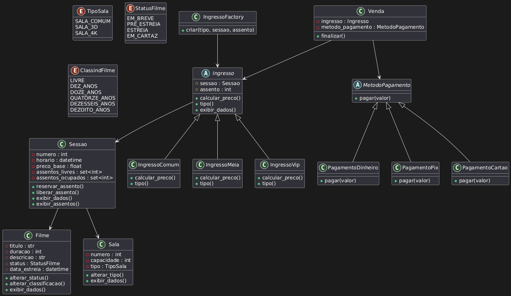

# Projeto final da disciplina de Tecnologia de Orientação à Objetos
Este projeto implementa um sistema de cinema simples desenvolvido em Python, utilizando os princípios da Orientação a Objetos (abstração, encapsulamento, herança e polimorfismo). O sistema gerencia e associa classes como filmes, salas de cinema, sessões, ingressos e pagamentos.

## Diagrama UML
O diagrama UML abaixo representa a arquitetura principal do sistema de gerenciamento de cinema. Ele descreve como os módulos se relacionam, permitindo visualizar com clareza a responsabilidade de cada classe.



## Principais Componentes

### Filme, Sala e Sessao formam o núcleo do sistema.
- **Filme** contém informações como título, duração e classificação indicativa.
- **Sala** define número, capacidade e tipo (Comum, 3D, 4K).
- **Sessao** relaciona um filme a uma sala em um horário específico, controlando assentos livres e ocupados.

### Ingresso é uma classe abstrata que representa um ticket de sessão.
- Possui subclasses específicas: **IngressoComum**, **IngressoMeia** e **IngressoVip**, cada uma com sua própria regra de preço.
- A criação dos ingressos é centralizada em uma **IngressoFactory**.

### O módulo de pagamento utiliza o padrão Strategy.
- **MetodoPagamento** é uma interface abstrata.
- Implementações incluem **PagamentoDinheiro**, **PagamentoPix** e **PagamentoCartao**.

### A classe Venda integra ingresso e método de pagamento, processando a transação final.

## Padrões de Design

### Padrão Factory
O padrão Factory é utilizado para criar diferentes tipos de ingressos no ato da venda (comum, VIP, meia). O objetivo é separar a lógica de criação dos ingressos em uma classe de fábrica, que cria instâncias diferentes de acordo com o tipo de ingresso solicitado.

### Padrão Strategy
O padrão Strategy é usado para definir diferentes métodos de pagamento. Cada estratégia de pagamento implementa o pagamento de forma distinta, permitindo flexibilidade ao realizá-lo.

# Estrutura das Classes e Pilares de POO

O sistema foi desenvolvido aplicando os quatro pilares fundamentais da Programação Orientada a Objetos: Abstração, Encapsulamento, Herança e Polimorfismo.  
A seguir descreve-se o papel de cada classe e como esses pilares foram utilizados.

## Filme
**Responsabilidades:**
- Armazena título, duração, classificação indicativa e status.
- Pode conter descrição e data de estreia.
- Permite alterar o status e a classificação.

**Pilares aplicados:**
- **Encapsulamento:** atributos privados com validações via properties.
- **Abstração:** métodos como `alterar_status()` e `exibir_dados()` ocultam detalhes internos.

## Sala
**Responsabilidades:**
- Armazena número, capacidade e tipo de sala.
- Permite alteração do tipo com validação.

**Pilares aplicados:**
- **Encapsulamento:** validações impedem valores inconsistentes.
- **Abstração:** expõe apenas métodos essenciais.

## Sessao
**Responsabilidades:**
- Armazena horário, filme, sala e preço base.
- Controla assentos livres e ocupados.
- Realiza reservas e liberações de assentos.

**Pilares aplicados:**
- **Encapsulamento:** conjuntos de assentos são privados.
- **Abstração:** lógica de controle de reservas é oculta.

## Ingresso (Classe Abstrata)
**Responsabilidades:**
- Armazena sessão e assento escolhido.
- Define a interface para cálculo de preço e tipo de ingresso.

**Pilares aplicados:**
- **Herança:** base para subclasses de ingresso.
- **Polimorfismo:** subclasses implementam diferentes cálculos.
- **Abstração:** classe não instanciável.

## IngressoComum, IngressoMeia, IngressoVip
**Pilares aplicados:**
- **Polimorfismo:** cada classe tem sua regra de preço.
- **Herança:** reutilizam a estrutura da classe Ingresso.

## IngressoFactory
**Responsabilidades:**
- Centraliza e padroniza a criação de ingressos.

**Pilares aplicados:**
- **Abstração:** o cliente não precisa conhecer a classe concreta.
- **Encapsulamento:** reserva de assento ocorre na criação.

## MetodoPagamento (Classe Abstrata)
**Pilares aplicados:**
- **Abstração:** exige implementação do método `pagar()`.
- **Polimorfismo:** diferentes estratégias de pagamento podem ser utilizadas.

## PagamentoDinheiro, PagamentoPix, PagamentoCartao
**Pilares aplicados:**
- **Polimorfismo:** cada classe implementa o pagamento de forma distinta.
- **Herança:** derivam de MetodoPagamento.

## Venda
**Responsabilidades:**
- Recebe ingresso e método de pagamento.
- Calula preço final e executa o pagamento.

**Pilares aplicados:**
- **Polimorfismo:** aceita qualquer tipo de MetodoPagamento.
- **Encapsulamento:** lógica da venda está completamente isolada.

# Instruções de Execução

Para executar o projeto localmente, siga os passos abaixo.

### 1. Clonar o repositório
```bash
git clone https://github.com/gabrieltanabe/TOO-Projeto-Final
```

### 2. Acessar o diretório do projeto
```bash
cd TOO-Projeto-Final
```

### 3. Executar o arquivo de testes
O arquivo `test_cinema.py` demonstra o funcionamento completo do sistema, incluindo:
- criação de filmes, salas e sessões;
- reserva e liberação de assentos;
- criação de ingressos via Factory Pattern;
- execução de pagamentos via Strategy Pattern;
- fluxo completo de venda.

Para executar:
```bash
python test_cinema.py
```

Ao rodar o comando, o terminal exibirá:
- dados dos filmes e salas;
- informações da sessão e assentos reservados;
- ingressos criados (comum, meia, VIP);
- processamento dos pagamentos (dinheiro, cartão e pix);
- confirmação da venda concluída.

### 4. Requisitos
- Python 3.10 ou superior.
- Nenhuma biblioteca externa adicional é necessária.
